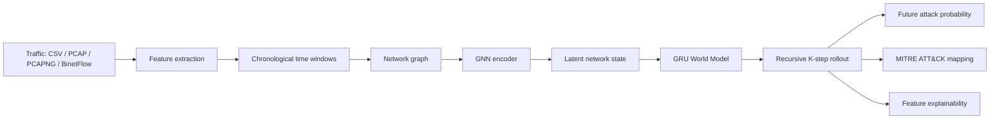

# Predictive SOC — Network Attack Forecasting

Predictive SOC is an offline research prototype for forecasting future network attack risk from traffic telemetry. It converts traffic into time-windowed communication graphs, encodes the current network state with a GNN, recursively simulates future latent states with a GRU World Model, and estimates future attack risk at a chosen horizon.

This repository contains source code, tests, configuration, and documentation. Datasets, trained checkpoints, PCAPs, and generated outputs are intentionally not included.

## Current status

The current validated smoke configuration is residual transition mode with `delta_scale=1.0` and forecast horizon `K=3`.

Latest smoke holdout results:

| Model | Precision | Recall | F1 | FPR | ROC-AUC |
| --- | ---: | ---: | ---: | ---: | ---: |
| World Model | 0.9923 | 0.6754 | 0.8037 | 0.0526 | 0.7435 |
| Logistic Regression baseline | 0.9259 | 0.9115 | 0.9186 | 0.7778 | 0.8585 |

The World Model does **not** currently outperform the logistic-regression baseline on classification metrics. Its purpose is learned network-state representation, recursive future-state simulation, future-risk forecasting, MITRE ATT&CK interpretation, and feature-based evidence. In the current smoke holdout experiment, it operates at a lower false-positive rate.

This is a research/smoke-validated prototype, not a production deployment or real-time monitoring system.

## Architecture



- Nodes represent observed hosts or network entities. When source/destination identities are unavailable, documented pseudo-node fallbacks are used rather than fabricated IP addresses.
- Edges represent observed communication flows. Node and edge features are derived from the supplied traffic.
- The GNN learns a graph-level representation of the current network state.
- The GRU World Model learns temporal transitions and recursively forecasts `z(t+1)` through `z(t+K)`.
- In residual mode, `z_next = z_current + delta_scale × tanh(raw_delta)`.
- Decoder heads estimate attack probability, future state, and ATT&CK tactic logits. The MITRE mapper returns supported tactic/technique interpretations only where mappings exist.

See [docs/architecture.md](docs/architecture.md) for implementation details.

## Offline dashboard

The Streamlit dashboard runs entirely locally:

```text
Upload → validation → feature extraction → time windows → graphs → GNN
→ current latent state → recursive rollout → attack forecast
→ MITRE interpretation + explainability → dashboard
```

Supported upload formats:

- CSV
- PCAP
- PCAPNG
- BinetFlow

The dashboard uses the actual local `checkpoints/world_model.pt` and fitted scaler. If required artifacts are missing or input parsing fails, it shows an error and does not produce substitute predictions.

## Development datasets

Development used CSE-CIC-IDS2018, CTU-13, and UNSW-NB15. Obtain them separately and place them under `datasets/`; do not commit datasets or archives.

```text
datasets/
  CIC-IDS2018/
  CTU-13-Dataset/
  UNSW-NB15/
```

## Project structure

```text
app.py                 Streamlit dashboard
src/                   GNN, world model, training, adapters, inference service
tests/                 Pipeline and inference tests
config.yaml            Paths and hyperparameters
docs/                  Architecture and dataset notes
checkpoints/           Generated locally; ignored
outputs/               Generated locally; ignored
datasets/              User-provided; ignored
```

## Installation (Windows)

```powershell
python -m venv .venv
.venv\Scripts\activate
python -m pip install -r requirements.txt
```

## Test

```powershell
python -m pytest -q
```

## Run the dashboard

```powershell
python -m streamlit run app.py
```

The dashboard requires locally generated checkpoint and scaler artifacts for model inference.

## Smoke training

Smoke mode is for validation and debugging only; it is not a final full-scale training procedure.

```powershell
python -m src.train --mode smoke --epochs 3 --transition residual --delta-scale 1.0
```

The pipeline also retains a direct-transition baseline for controlled experiments. Do not infer production readiness from smoke metrics alone.

## Limitations

1. The current model is a research/smoke model.
2. Full-scale training and broader validation are still required.
3. Attack probabilities are model outputs, not calibrated probabilities unless calibration is explicitly added.
4. MITRE mappings are predicted interpretations, not confirmed incidents.
5. The application is offline; it does not provide real-time network monitoring.
6. Performance depends on the quality and schema of supplied traffic.
7. Current evaluation is insufficient to claim production deployment readiness.

## Future work

- Full-scale training and cross-dataset validation
- Probability calibration
- More robust PCAP/PCAPNG ingestion
- Longer-horizon forecasting
- Improved uncertainty estimation
- Enterprise deployment patterns
- Real-time telemetry integration

## Repository safety

`.gitignore` excludes datasets, checkpoints, outputs, packet captures, archives, model artifacts, caches, virtual environments, and environment files. It does not globally ignore ordinary source CSV/config files.
